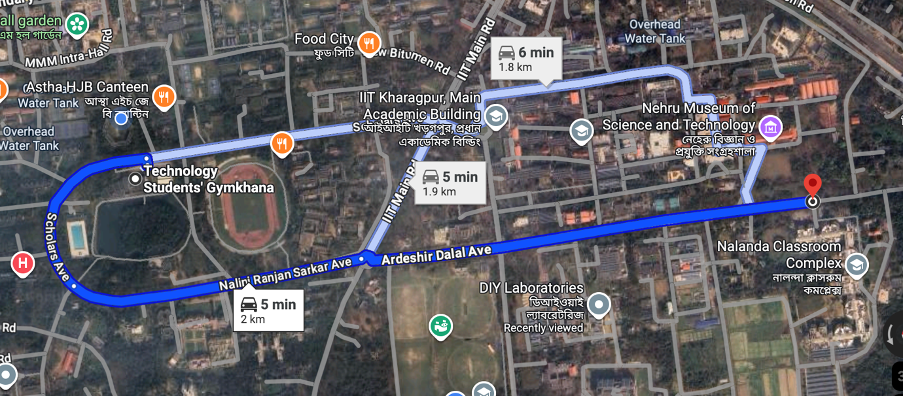
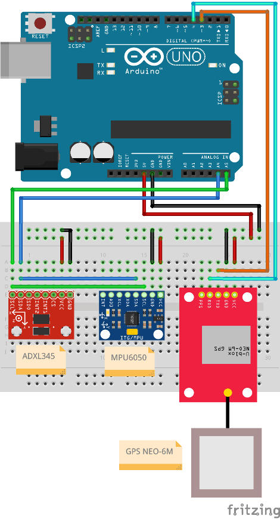
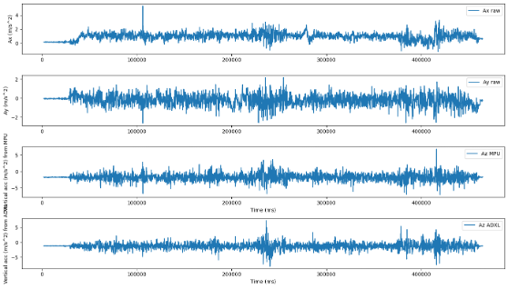
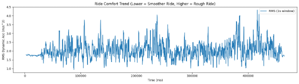
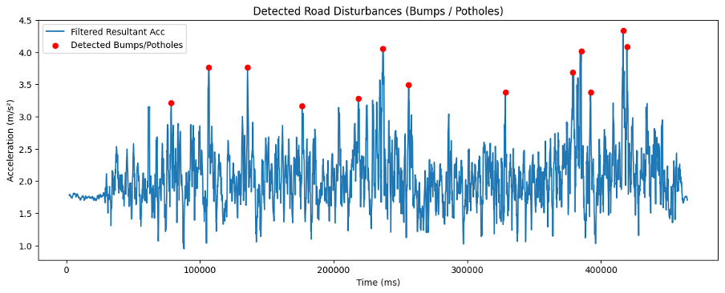
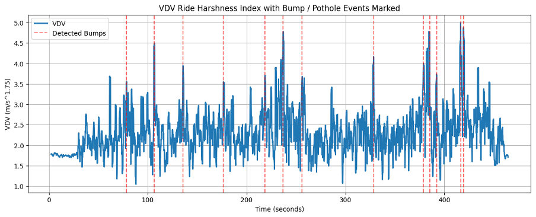
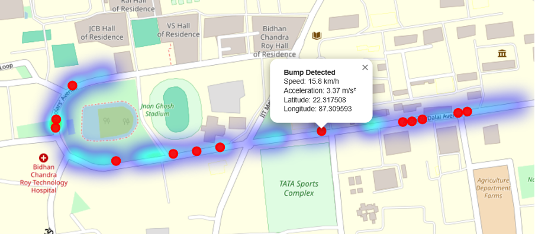
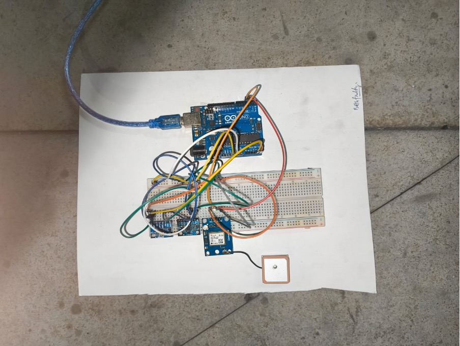
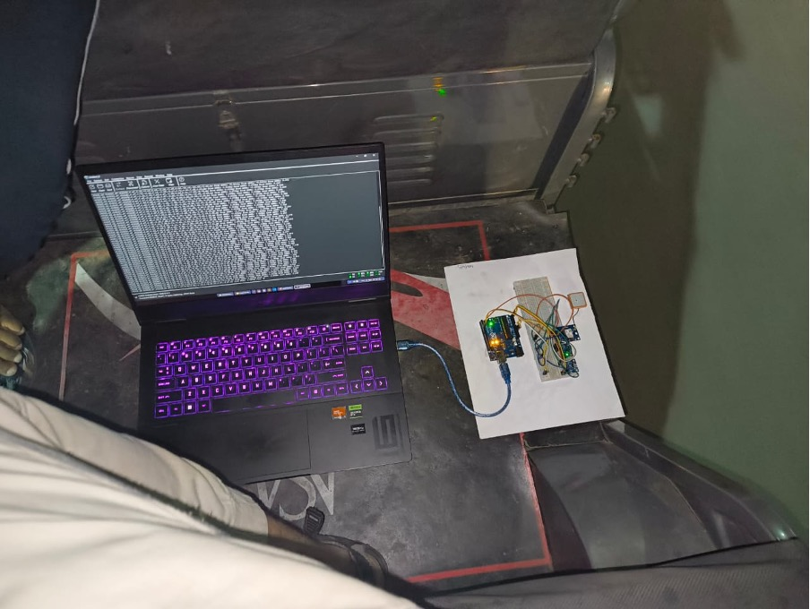

# GPS-Based Road Condition Monitoring Using Low-Cost Inertial Sensors
### MECHATRONICS LABORATORY (ME22201) Course Project
**Prepared by:** C2G15 Group (P Prajit – 24MF10047, Riddhi Maiti – 24MF10051, Nare Mahith Sai – 24MF10043)

---

## Abstract
This report documents a vibration measurement study carried out along the 2.2 Road route from Gymkhana to Nehru Museum at IIT Kharagpur. Measurements were taken by riding a campus toto equipped with two inertial sensors (MPU6050 and ADXL345) and a GPS receiver to provide geographic tagging. The objective of this study was to characterize road roughness and the in-vehicle vibrational environment, ultimately providing actionable recommendations for road maintenance and vehicle comfort. 

---

## Table of Contents
1. Problem Statement
2. State of the Art
3. Objectives
4. Work Plan and Schedule
5. Equipment & Specifications
6. Connection Diagram
7. Results
8. Discussion
9. Conclusions
10. Recommendations
11. References

---

## 1. Problem Statement
Road roughness and localized defects cause vehicle vibrations that negatively affect passenger comfort and vehicle fatigue life, while also serving as indicators of pavement deterioration. The 2.2 Road between Gymkhana and Nehru Museum at IIT Kharagpur is used frequently by campus vehicles, including totos. The goal of this study is to quantify the vibration levels experienced during a typical toto ride along this route, identify hotspots with elevated vibrations, and provide engineering metrics along with actionable recommendations for maintenance.

**Key Questions:**
* Where along the route are the vibration levels unusually high (hotspots)?
* How do the two accelerometers (MPU6050 and ADXL345) compare in their measured responses?
* What do the extracted vibration metrics imply about passenger comfort and current pavement conditions?

---

## 2. State of the Art
* Road roughness is commonly quantified using profile-derived indices, such as the International Roughness Index (IRI), or accelerometer-derived metrics including RMS acceleration, power spectral density, and Vibration Dose Value (VDV).
* Accelerometers mounted in vehicles are widely used for rapid road condition surveys when dedicated profilometers are unavailable.
* Low-cost MEMS accelerometers, such as the MPU6050 and ADXL345, have been shown in numerous studies to be adequate for relative road condition mapping when appropriately calibrated and filtered.
* Typical limitations of these sensors include bias instability, temperature sensitivity, and reduced accuracy at very low frequencies.
* GPS (NMEA) data are crucial for geolocating measurement windows and computing vehicle speed.
* Careful timestamp synchronization between GPS and IMU data is necessary to ensure reliable hotspot mapping.
* Standard guidance on human exposure to whole-body vibration is outlined in the ISO 2631 series (e.g., ISO 2631-1), which describes metrics such as VDV for comfort evaluation.

---

## 3. Objectives
* Acquire synchronized 3-axis accelerometer data and GPS position/time data along the entire 2.2 Road route using a toto as the measurement platform.
* Process raw sensor data to remove noise and bias, align timebases, and transform sensor axes to vehicle axes as required.
* Compute vibration metrics per road segment, including RMS acceleration, peak values, and VDV where applicable.
* Produce a geolocated vibration heatmap illustrating hotspots along the route and provide a ranked list of problematic locations.
* Compare the MPU6050 and ADXL345 accelerometers for consistency to recommend best practices for future surveys.
* Provide recommendations for road maintenance, ride comfort improvement, and future measurement enhancements.

---

## 4. Work Plan and Schedule

**Phase 1 — Preparation (1 week)**
* Finalize the sensor mounting and logging system.
* Write and verify the data-logging firmware.
* Conduct pre-test bench calibration.

**Phase 2 — Field Data Collection (1–3 days)**
* Perform multiple runs (a minimum of 2 runs during similar daytime conditions and passenger loads) along the route at typical toto speeds.
* Record environmental notes such as weather, passenger load, and route deviations.

**Phase 3 — Data Processing & Analysis (1–2 weeks)**
* Preprocess the data by resampling, time-syncing, filtering, and removing offsets.
* Compute metrics per fixed-length segments (e.g., 10 m or 50 m windows) to identify hotspots.

**Phase 4 — Reporting & Recommendations (1 week)**
* Create visualizations, map overlays, and finalize the report.

---

## 5. Equipment & Specifications
* **MPU6050:** A 3-axis accelerometer and 3-axis gyroscope featuring a configurable accelerometer range of ±2/±4/±8/±16 g and internal sampling via I2C.
* **ADXL345:** A 3-axis accelerometer with selectable ranges of ±2/±4/±8/±16 g and a digital I2C interface.
* **GPS module (Neo-6M):** Provides UTC position and time via NMEA sentences, capable of logging at 1–10 Hz.
* **Arduino Uno:** Serves as the microcontroller for data acquisition and timestamps.
* **Laptop / Software:** Utilizes Python (pandas, numpy, scipy, matplotlib) for data handling, folium for mapping, and Jupyter for processing.

---

## 6. Connection Diagram
The project utilizes a circuit connected via a breadboard integrating the Arduino Uno, GPS NEO-6M, MPU6050, and ADXL345.

---

## 7. Results
The data collection yielded several major graphical interpretations outlining the vibrational impacts along the route:
* **Raw and Filtered Accelerations:** Visualized across the X, Y, and Z axes for both the MPU6050 and ADXL345 sensors.
  
  
* **Ride Comfort Trend:** A graph displaying RMS Dynamic Acceleration computed over 1-second windows, where lower values correlate to a smoother ride and higher values indicate roughness.
  
  
* **Detected Road Disturbances:** A resultant acceleration plot highlighting localized bumps and potholes marked by defined peaks.
  
  
* **VDV Ride Harshness Index:** Displayed alongside detected bump/pothole events for objective comfort assessment.
  
  
* **Geolocation Heatmap:** A visual map noting severity hotspots, speed, and specific acceleration metrics for notable bump locations.
  
  
* **Hardware Setup:** The functional circuit was assembled on cardboard plating, double-taped to the floor of the toto, and connected to a laptop running Coolterm for data collection.
  
  
  

---

## 8. Discussion
* **Vehicle Influence:** The soft suspension of the toto inherently increases sensitivity to small bumps. While this is useful for assessing passenger comfort, it implies that measured magnitudes are vehicle-dependent. For structural pavement assessment, vehicle-type correction or reference vehicle data may be required.
* **Sensor Redundancy:** The simultaneous use of both the MPU6050 and ADXL345 improved overall confidence in detected events. Slight amplitude differences are expected due to variations in sensor range, filters, and axis alignment.
* **GPS Limitations:** The standard NEO-6M GPS operating at 1 Hz provides a spatial resolution of roughly 3–5 m at walking speeds. For higher-precision localization, higher-rate GNSS or differential methods are suggested.
* **Repeatability:** Comparing two passes on the identical segment is highly recommended; high repeatability increases confidence in the localized road defects.

---

## 9. Conclusions
* Low-cost MEMS accelerometers (MPU6050 and ADXL345) mounted on a toto effectively detected and localized road irregularities along the 2.2 Road at IIT Kharagpur.
* The combined IMU and GPS approach produced a detailed spatial map of road roughness that is highly useful for maintenance prioritization.
* Sensor fusion alongside proper gravity compensation successfully improved the quality of the derived vibration metrics.
* Future improvements could include implementing higher GPS sampling rates, conducting additional passes for statistical validation, and potentially utilizing fleet-based collection to average out vehicle-specific biases.

---

## 10. Recommendations
* Prioritize immediate repairs at high-severity hotspots based on collected coordinate data.
* Establish a standard mounting plate location and baseline sampling frequency for routine monitoring purposes.
* Improve spatial data quality by utilizing a GPS unit with a higher update rate or by attaching an external antenna for a stronger connection.
* Consult ISO 2631-1 thresholds during human comfort assessments prior to declaring definitive health risks.
* Conduct similar experiments iteratively at varying vehicle speeds while performing a parametric sweep of hyperparameters (e.g., bump peak prominence) to accurately pinpoint major defects and focus maintenance attention effectively.

---

## 11. References
* Behaviour of Metro Coach on Newly Built Track in Kolkata – Prof. V. Racherla, Dr. S.K. Singh, Dr. H. Danawe.
* MPU-6050 Product Specification (InvenSense) datasheet.
* ADXL345 Datasheet (Analog Devices).
